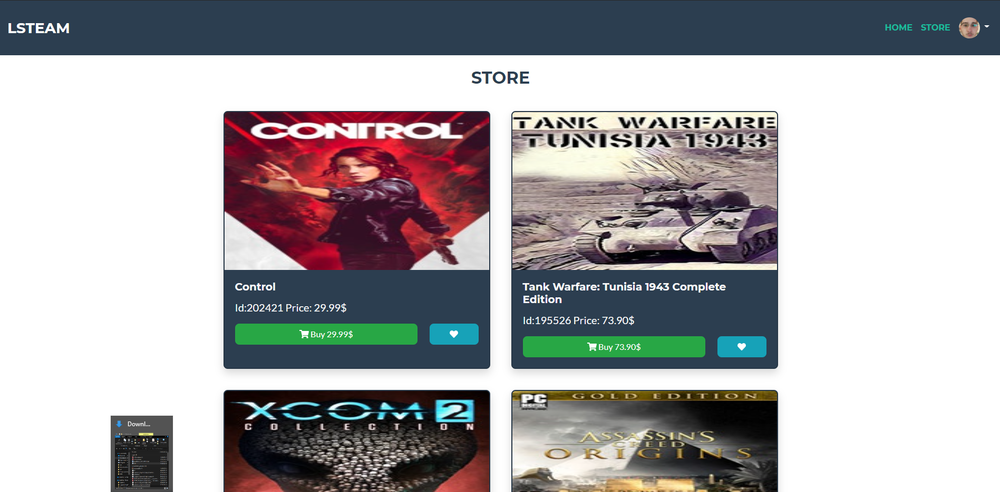
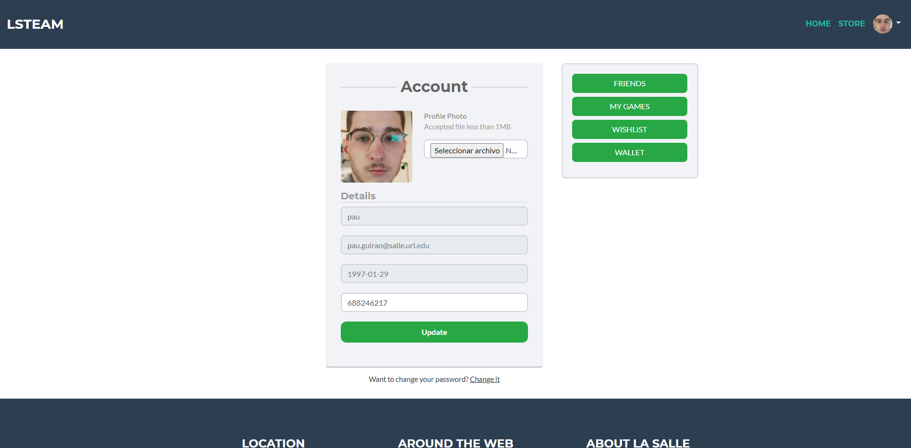

### MySQL database test


This creates the database.

```sql
DROP DATABASE IF EXISTS test;
CREATE DATABASE test;
USE test;
```
### MySQL table user

This table contains all the users information

```sql
DROP TABLE IF EXISTS user;
CREATE TABLE user (
  id int unsigned NOT NULL AUTO_INCREMENT,
  username varchar(255) CHARACTER SET utf8 COLLATE utf8_bin NOT NULL,
  email varchar(255) CHARACTER SET utf8 COLLATE utf8_bin NOT NULL,
  password varchar(255) CHARACTER SET utf8 COLLATE utf8_bin NOT NULL,
  birthdate varchar(255) CHARACTER SET utf8 COLLATE utf8_bin NOT NULL,
  phone varchar(255) CHARACTER SET utf8 COLLATE utf8_bin NOT NULL,
  money float unsigned NOT NULL,
  token varchar(255) CHARACTER SET utf8 COLLATE utf8_bin NOT NULL,
  status varchar(255) CHARACTER SET utf8 COLLATE utf8_bin NOT NULL DEFAULT 'Inactive',
  PRIMARY KEY (id)
) ENGINE=InnoDB DEFAULT CHARSET=utf8mb4 COLLATE=utf8mb4_0900_ai_ci;
```
### MySQL table game

This table contains all the games information

```sql
DROP TABLE IF EXISTS game;
CREATE TABLE game (

  game_id int unsigned NOT NULL,
  title varchar(255) CHARACTER SET utf8 COLLATE utf8_bin NOT NULL,
  price float unsigned NOT NULL,
  thumbnail VARCHAR(255) CHARACTER SET utf8 COLLATE utf8_bin NOT NULL,
  PRIMARY KEY (game_id)

) ENGINE=InnoDB DEFAULT CHARSET=utf8mb4 COLLATE=utf8mb4_0900_ai_ci;
```
### MySQL table userGame

This table contains all the user's games information

```sql
DROP TABLE IF EXISTS `userGame`;
CREATE TABLE `userGame` (
  `u_id` int unsigned NOT NULL,
  `game_id` int unsigned NOT NULL,
  PRIMARY KEY (`u_id`,`game_id`),
  KEY `game_id` (`game_id`),
  CONSTRAINT `userGame_ibfk_1` FOREIGN KEY (`u_id`) REFERENCES `user` (`id`),
  CONSTRAINT `userGame_ibfk_2` FOREIGN KEY (`game_id`) REFERENCES `game` (`game_id`)
) ENGINE=InnoDB DEFAULT CHARSET=utf8mb4 COLLATE=utf8mb4_0900_ai_ci;
```
### MySQL table profileimg

This table contains all the user's profile images

```sql
DROP TABLE IF EXISTS `profileimg`;
CREATE TABLE `profileimg` (
  `uuid` char(36) CHARACTER SET utf8 COLLATE utf8_general_ci NOT NULL DEFAULT '12345678abcdefgh',
  `user_id` int unsigned NOT NULL,
  PRIMARY KEY (`user_id`),
  KEY `uuid` (`uuid`),
  CONSTRAINT `profileimg_ibfk_1` FOREIGN KEY (`user_id`) REFERENCES `user` (`id`)
) ENGINE=InnoDB DEFAULT CHARSET=utf8;
```
### MySQL table wishilist

This table contains the user's wishilist of games

```sql
DROP TABLE IF EXISTS `wishlist`;
CREATE TABLE `wishlist` (
  `u_id` int unsigned NOT NULL,
  `game_id` int unsigned NOT NULL,
  PRIMARY KEY (`u_id`,`game_id`),
  KEY `game_id` (`game_id`),
  CONSTRAINT `userGame_ibfk_3` FOREIGN KEY (`u_id`) REFERENCES `user` (`id`),
  CONSTRAINT `userGame_ibfk_4` FOREIGN KEY (`game_id`) REFERENCES `game` (`game_id`)
) ENGINE=InnoDB DEFAULT CHARSET=utf8mb4 COLLATE=utf8mb4_0900_ai_ci;
```

### MySQL table friend

This table contains the user´s friends

```sql
DROP TABLE IF EXISTS `friend`;
CREATE TABLE `friend` (
  `username_1` varchar(255) CHARACTER SET utf8 COLLATE utf8_bin NOT NULL,
  `username_2` varchar(255) CHARACTER SET utf8 COLLATE utf8_bin NOT NULL,
  `accept_date` varchar(255) CHARACTER SET utf8 COLLATE utf8_bin NOT NULL
) ENGINE=InnoDB DEFAULT CHARSET=utf8mb4 COLLATE=utf8mb4_0900_ai_ci;
```

### MySQL table friend requests

This table contains the user´s friend requests.

```sql
DROP TABLE IF EXISTS `friendRequest`;
CREATE TABLE `friendRequest` (
  `request_id` int unsigned NOT NULL AUTO_INCREMENT,
  `user_sender` varchar(255) CHARACTER SET utf8 COLLATE utf8_bin NOT NULL,
  `user_receiver` varchar(255) CHARACTER SET utf8 COLLATE utf8_bin NOT NULL,
  `state` varchar(255) CHARACTER SET utf8 COLLATE utf8_bin NOT NULL,
  PRIMARY KEY (`request_id`)
) ENGINE=InnoDB DEFAULT CHARSET=utf8mb4 COLLATE=utf8mb4_0900_ai_ci;
```
